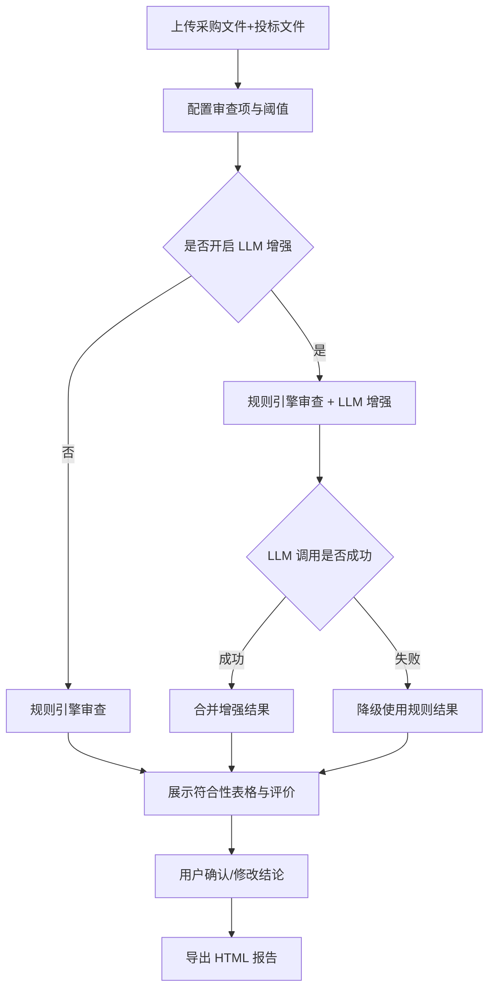

# 投标书内容审查系统 - 产品需求文档（PRD）

## 1. 产品概述

面向政府采购/工程招投标场景的投标书符合性审查 Web 应用，支持上传 1-5 家公司的 Word 投标文件，与采购文件及项目需求进行智能比对，自动生成标准化符合性检查表与详细比对报告，并支持 HTML 导出。核心采用规则引擎实现（离线可用），LLM 作为可选增强模块。

- 解决问题：人工审查耗时、易遗漏、标准不统一
- 目标用户：招标审查人员、评标专家
- 产品价值：提升审查效率与一致性，降低遗漏风险

## 2. 核心功能

### 2.1 用户角色

| 角色 | 注册方式 | 核心权限 |
|------|---------|---------|
| 审查人员 | 无需注册，本地使用 | 上传文件、配置审查项、查看报告、确认/修改结论、导出 HTML |

### 2.2 功能模块

1. **文件上传页**：采购文件、项目需求、1-5 家投标文件上传
2. **审查配置页**：审查项模板选择、匹配阈值、LLM 增强配置
3. **结果展示页**：符合性检查表格、比对详情、专业评价
4. **报告导出页**：HTML 报告生成与下载

### 2.3 页面详情

| 页面名称 | 模块名称 | 功能描述 |
|---------|---------|---------|
| 文件上传页 | 采购文件上传 | 支持 .doc/.docx 拖拽上传，显示文件名与状态 |
| 文件上传页 | 项目需求上传 | 支持文本或 Word 文件 |
| 文件上传页 | 投标文件批量上传 | 1-5 家公司，可添加/删除，显示公司名 |
| 审查配置页 | 审查项模板 | 报名资格/承诺条款/技术偏离三大类，可勾选子项 |
| 审查配置页 | 匹配阈值 | 滑块调节 0-100%，默认 75% |
| 审查配置页 | LLM 增强（可选） | 开关、服务商选择、API Key、增强范围、隐私提示 |
| 结果展示页 | 符合性检查表格 | 审查项 × 公司矩阵，状态色标（符合/偏离/不符合/未响应） |
| 结果展示页 | 比对详情面板 | 选中单元格展示采购要求 vs 投标原文 |
| 结果展示页 | 专业评价区 | 综合评分、风险提示、建议结论（可编辑） |
| 报告导出页 | 导出选项 | 勾选导出内容，生成并下载 HTML 报告 |

## 3. 核心流程

用户上传采购文件和 1-5 家投标文件 → 配置审查项与阈值（可选开启 LLM）→ 系统执行规则引擎审查（LLM 增强则在规则结果基础上二次优化）→ 展示符合性表格与专业评价 → 用户确认/修改结论 → 导出 HTML 报告。

## 4. 用户界面设计

### 4.1 设计风格

- **主色调**：深色背景（#0a0e1a），霓虹青色 #00f0ff、霓虹品红 #ff00aa、荧光绿 #00ff88
- **按钮风格**：霓虹边框 + 发光悬停效果，赛博朋克科技感
- **字体**：等宽字体（JetBrains Mono / Consolas），科技感强
- **布局风格**：顶部步骤导航 + 卡片式内容区，网格布局
- **图标/emoji**：使用霓虹风格线性图标，状态用 ✓△✗○ 符号

### 4.2 页面设计概览

| 页面名称 | 模块名称 | UI 元素 |
|---------|---------|---------|
| 文件上传页 | 上传区域 | 拖拽框（霓虹边框+发光）、文件列表卡片、进度条 |
| 审查配置页 | 配置表单 | 分组复选框、阈值滑块、LLM 折叠面板（开关+下拉+输入框） |
| 结果展示页 | 符合性表格 | 彩色状态单元格、悬停高亮、点击展开详情抽屉 |
| 结果展示页 | 专业评价 | 评分进度条、风险标签、可编辑结论输入框 |
| 报告导出页 | 导出区 | 内容勾选框、生成按钮、下载提示 |

### 4.3 响应式

桌面端优先设计，适配 1280px 以上屏幕；移动端自适应布局，表格横向滚动。

## 5. 非功能需求

- **性能**：单次审查（5 家）耗时 ≤ 30 秒（规则版）
- **安全**：无本地数据库，数据仅存内存；API Key 不持久化
- **兼容性**：支持 Chrome、Edge 最新版
- **离线可用**：规则版完全离线，LLM 版需联网
