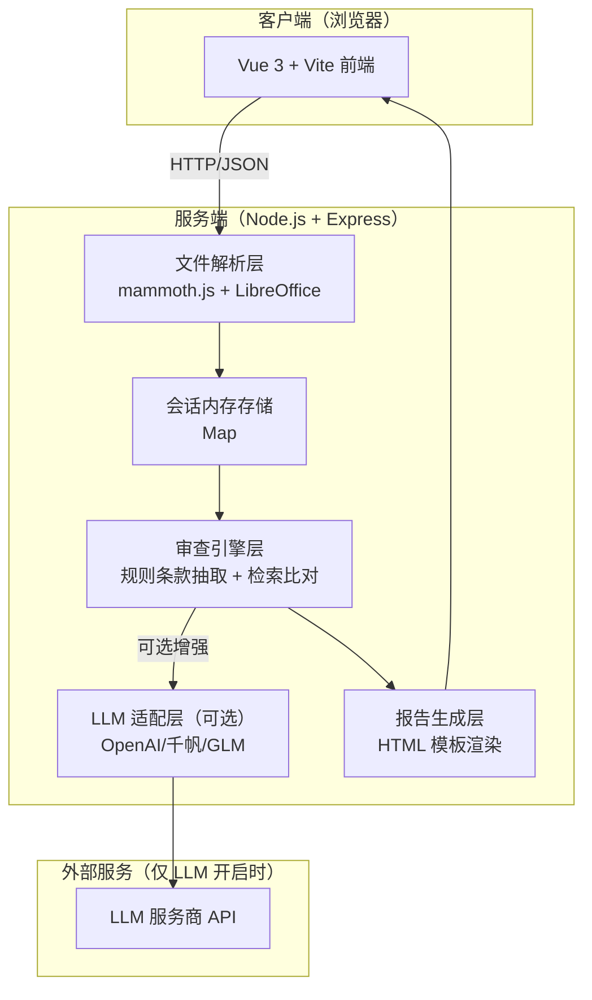

# 投标书内容审查系统 - 技术架构文档

## 1. 架构设计



## 2. 技术说明

- **前端**：Vue@3 + Vite@5 + Element Plus + ECharts
- **初始化工具**：Vite
- **后端**：Express@4
- **Word 解析**：mammoth.js（.docx）+ LibreOffice headless（.doc→.docx）
- **LLM 增强（可选）**：统一适配层封装 OpenAI / 百度千帆 / 智谱 GLM / 本地兼容模型
- **报告导出**：ejs 模板渲染 HTML，内联 CSS
- **数据存储**：进程内内存 Map，无数据库

## 3. 路由定义

| 路由 | 用途 |
|------|------|
| / | 主应用（单页，步骤式切换） |

## 4. API 定义

### 4.1 文件上传

```typescript
POST /api/upload
Request: multipart/form-data
  - procurement: File
  - projectReq?: File
  - bidders: File[] (1-5)
Response: {
  sessionId: string,
  procurement: { name, text, sections },
  bidders: [{ id, name, fileName, text, sections }]
}
```

### 4.2 执行审查

```typescript
POST /api/review
Request: {
  sessionId: string,
  config: {
    items: string[],
    threshold: number,
    llm: {
      enabled: boolean,
      provider: string,
      apiKey: string,
      scope: string[]
    }
  }
}
Response: {
  sessionId: string,
  complianceTable: [...],
  comparisonDetails: [...],
  evaluation: { score, risks, conclusion },
  llmEnhanced: boolean
}
```

### 4.3 获取结果

```typescript
GET /api/result/:sessionId
Response: ReviewResult
```

### 4.4 导出报告

```typescript
POST /api/export
Request: { sessionId, options }
Response: text/html (attachment)
```

## 5. 数据模型（内存）

```typescript
interface Task {
  sessionId: string;
  procurementDoc: { name: string; text: string; sections: Section[] };
  projectRequirements?: { text: string; clauses: Clause[] };
  bidders: Bidder[];
  reviewConfig: ReviewConfig;
  reviewResult?: ReviewResult;
  createdAt: number;
}

interface Section {
  level: number;
  title: string;
  content: string;
}

interface Bidder {
  id: string;
  name: string;
  fileName: string;
  text: string;
  sections: Section[];
}

interface ReviewConfig {
  items: string[];
  threshold: number;
  llm: {
    enabled: boolean;
    provider: string;
    apiKey: string;
    scope: string[];
  };
}

interface ReviewResult {
  complianceTable: {
    headers: string[];
    rows: {
      item: string;
      category: string;
      cells: { status: string; score: number; evidence: string; deviation: string }[];
    }[];
  };
  comparisonDetails: any[];
  evaluation: { score: number; risks: string[]; conclusion: string };
  llmEnhanced: boolean;
}
```

## 6. 目录结构

```
biddingautho/
├── client/                  # 前端 Vue 项目
│   ├── src/
│   │   ├── views/           # 页面组件
│   │   ├── components/      # 通用组件
│   │   ├── api/             # 接口封装
│   │   ├── stores/          # 状态管理
│   │   ├── styles/          # 全局样式（赛博朋克主题）
│   │   └── App.vue
│   └── package.json
├── server/                  # 后端 Express 项目
│   ├── src/
│   │   ├── routes/          # 路由
│   │   ├── services/        # 业务逻辑
│   │   ├── parsers/         # Word 解析
│   │   ├── engine/          # 审查引擎
│   │   ├── llm/             # LLM 适配层
│   │   ├── report/          # 报告生成
│   │   └── store/           # 内存存储
│   └── package.json
└── .trae/documents/         # 设计文档
```
